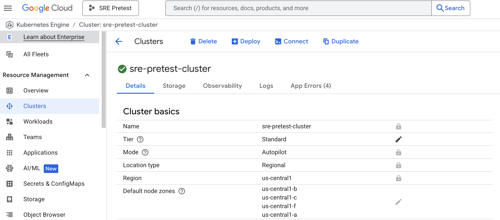
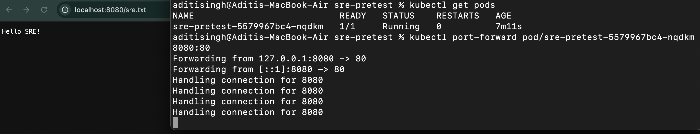

# SRE Pre-test

## Topic 1
**Terraform:** Create a Kubernetes cluster on GCP using terraform

**Pre-requisite:**
- Install terraform from [link](https://developer.hashicorp.com/terraform/install), if not already installed.
- Create GCP account and enable Billing.
- Create a Project `SRE Pretest`.
- Enable `Kubernetes Engine API`.

**Steps to run in local:**
- Clone the repository and `cd` to `gke-cluster` directory
- Log in to gcp cloud account and set project `SRE Pretest` config.
- Run `terraform init` to initialize the cloud provider
- Run `terraform plan` to view expected changes
- Run `terrform apply` to create the cluster



## Topic 2
**Build:** Write a Dockerfile to build a custom nginx image.

**Pre-requisite:**
- Docker needs to be installed before running in local.

**Steps to run in local:**
- Clone the repository or alternatively, download [sre.txt](https://github.com/aditi278/sre-pretest/blob/main/sre.txt) and [Dockerfile](https://github.com/aditi278/sre-pretest/blob/main/Dockerfile).
- Execute `docker build` command to build an image from above Dockerfile
```
docker build -t sre-pretest .
```
- Execute `docker run` command to start a container. Expose the port using `-p` flag for local access
```
docker run --name pretest-nginx -d -p 8080:80 sre-pretest
```
- Open http://localhost:8080/sre.txt in your browser to view the text.


## Topic 3
**Deploy:** Deploy and expose the above image to kubernetes cluster

**Option 1:** In this case I've created the deployment and service yaml files which can be used to deploy image directly using `kubectl` commands.

**Pre-requisite:**
- Install `kubectl` and `gcloud` CLI tools

**Steps to run in local:**
- Log in to your gcp cluster
- Run `kubectl apply -f manifests/deployment.yaml`
- Run `kubectl apply -f manifests/service.yaml`
- Verify pod and service is running `kubectl get pods` & `kubectl get svc`


**Option 2:** Alternatively, I've utilized generative AI and used the below prompt to create helm chart: 
```
Make a helm chart for deploying a customised nginx image to gcp kubernetes cluster along with a load balancer to expose the service externally. Share a step-by-step process for deployment using above manifests
```
**Pre-requisite:**
- Install `kubectl`, `helm` and `gcloud` CLI tools.

**Steps to run in local:**
- Log in to your gcp cluster.
- `cd` to `helm` directory.
- Run `helm upgrade --install sre-pretest .` to install or upgrade the chart if it already exists.
- Verify pod and service is running `kubectl get pods` & `kubectl get svc`.


## Topic 4
**CI/CD:** Build a CI/CD pipeline for above topics.
**Solution:**
I've used githubActions to build a CI-CD pipeline to build and deploy the infrastructure and image. The workflow will start running when there is `push` on the `main` branch
Workflow is divided in 3 steps:
- Terraform: To create a Kubernetes cluster using terraform in GCP cloud account
- Build: This step is to build image using docker and push the image to docker hub.
- Deploy: This is to deploy the image in GKE cluster using Helm chart.

Code: [ci-cd.yaml](https://github.com/aditi278/sre-pretest/blob/main/.github/workflows/ci-cd.yaml)

Run: [Job](https://github.com/aditi278/sre-pretest/actions/runs/16411168376)


## Topic 5
**Objective:** Please describe, with examples if possible, how to use the concept of GitOps, the CI/CD Pipeline you built in question 4 can support multi-environment deployments (such as alpha, beta, staging, production) based on the same codebase or package manager.

**Solution Approach:**
To support multi-environment deployments, we need to coordinate the workflow process to account for different environments.
Strategies:

**Github Environments**
- Use Github Environments to target the environment to deploy (dev, stage, prod).
- Create a separate github environment to store vars and secrets for that env. Thus making it possible to use same pipeline for different environments.

**Manual Trigger**
- Currently, the workflow will run on push to main branch. But this approach is not feasible for prod env.
- Instead we can use `workflow_dispatch` to manually trigger the pipeline.
- We can add Input Options: dev/stage/prod, to specify the env for a run.

**Terraform**
- We can use a directory format to separate out terraform files. 
- For eg. gke-cluster directory will have multiple directories, 1 for each environment (say dev, stage, prod), then each directory will have terraform `variables.auto.tfvars` file for the env. We can keep common `.tf` files in gke-cluster directory to avoid duplication. 

**Helm**
- One way to support multi-environment deploy is by passing the env specific values stored in Github Environments
- Other way can to create environment specific files, for eg. values-dev.yaml, values-stage.yaml...

## Topic 6
**Objective:** Continuing from questions 4 and 5, if your web service needs to reference resources created by Terraform, what method would you use to link them? For example, In the Helm chart of the web service there may be a need to fill in the name of a CloudArmor policy created by Terraform as an annotation.

**Solution Approach:**
To create a reference from resources created by terraform to the web service, we'll first need to output the terraform data, then pass it from `terraform` job to `deploy` job and then to helm. Let's go through a step-by-step process:

**Updates in Terraform Job:**
- Create an `output.tf` file, like
```
output "cloudarmor_policy_name" {
  value = google_compute_security_policy.example.name
}
```
- Then we need output the data in pipeline after we apply terraform, using command `terraform output -json > tf-outputs.json `
- Upload the json output file to artifact or COS bucket

**Updates in Deploy Job:**
- Download the json output file from artifact or COS bucket
- Parse file and save varible in github env
- Pass the variable using `--set` flag in helm, Eg
```
helm upgrade --install sre-pretest helm --set image.repository=${{vars.DOCKER_USERNAME}}/sre-pretest --set cloudarmor.policyName="$policy_name"
```

**Updates in Helm Chart:**
- Add the annotation in helm templates
```
metadata:
  annotations:
    cloud.google.com/armor-policy: {{ .Values.cloudarmor.policyName }}
```
